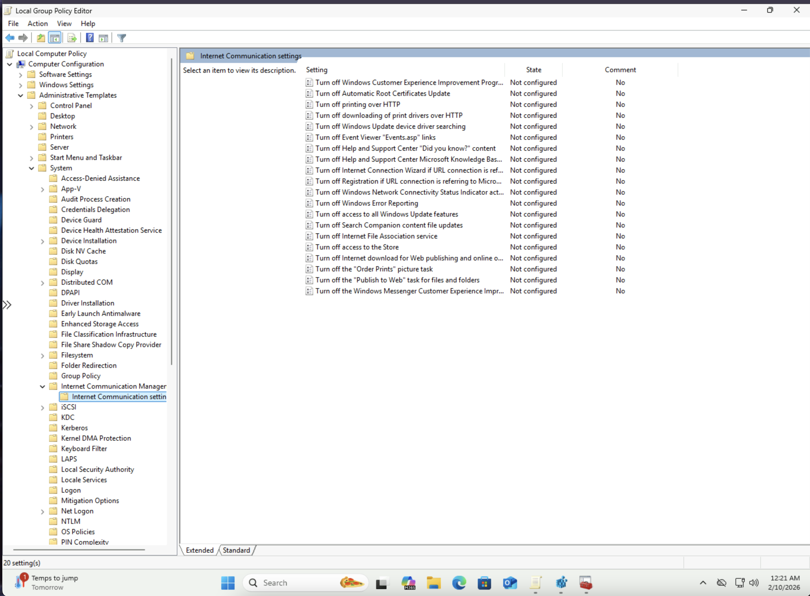
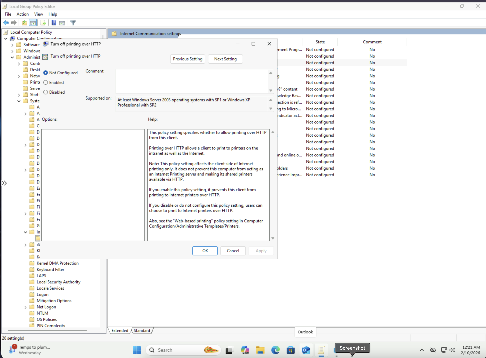
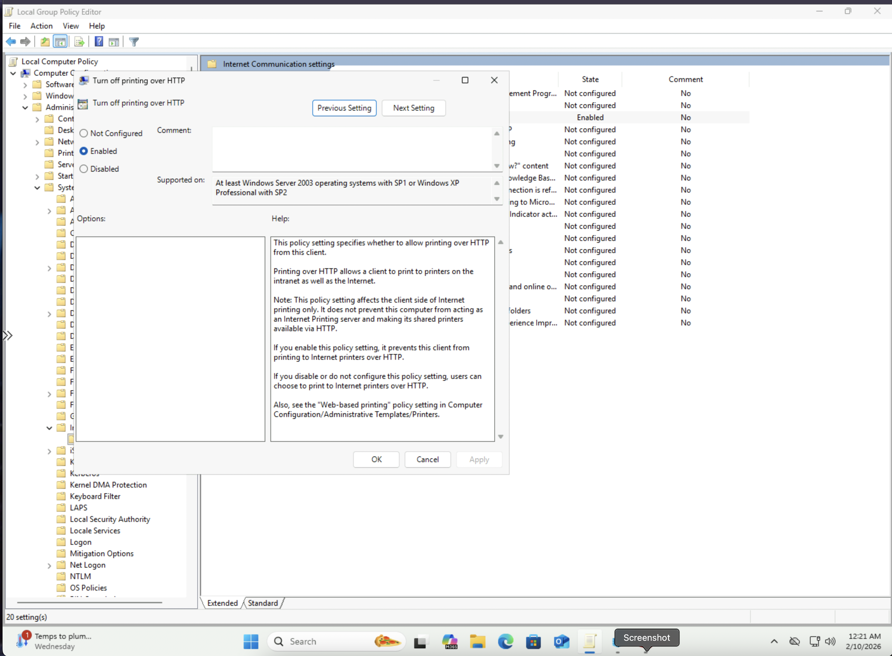
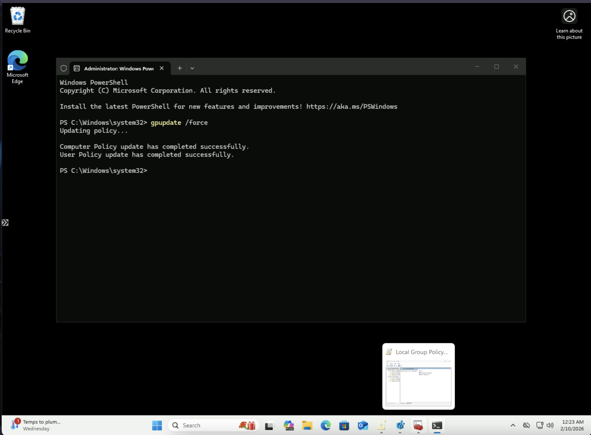
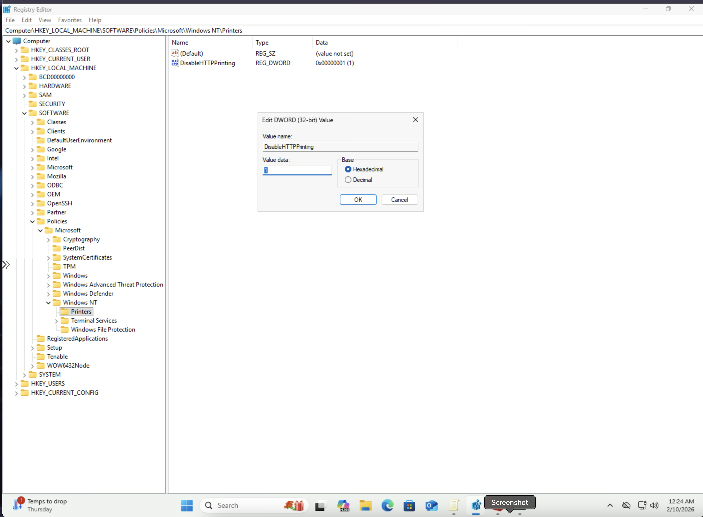
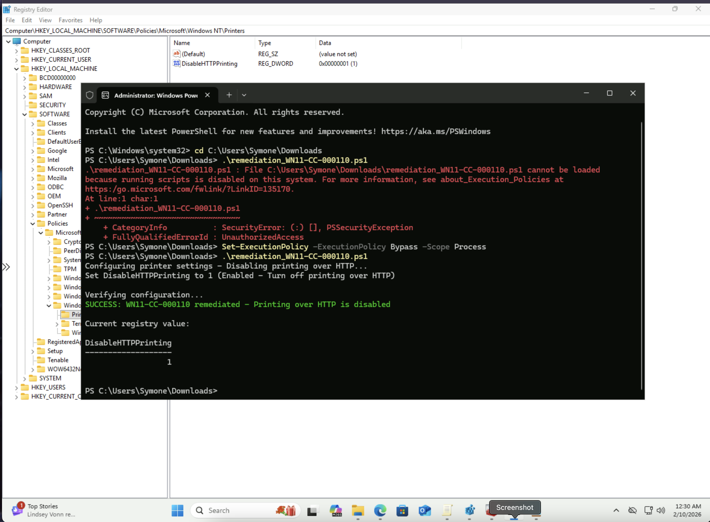

# Windows STIG WN11-CC-000110 Remediation

## Overview
This repository contains remediation for STIG vulnerability WN11-CC-000110: "Printing over HTTP must be prevented."

## Vulnerability Details
- **STIG-ID**: WN11-CC-000110
- **Vuln-ID**: V-253376
- **Severity**: CAT II
- **Description**: Printing over HTTP allows data to be transmitted unencrypted across the network. Disabling this feature ensures that print jobs are transmitted securely, preventing potential interception of sensitive information.

## Remediation Methods

### Automated (PowerShell Script)
Run the `remediation_WN11-CC-000110.ps1` script as Administrator to automatically disable printing over HTTP.

**To run:**
```powershell
PS C:\> .\remediation_WN11-CC-000110.ps1
```

### Manual (Group Policy Editor)
1. Open Local Group Policy Editor (`gpedit.msc`)
2. Navigate to: `Computer Configuration` → `Administrative Templates` → `System` → `Internet Communication Management` → `Internet Communication settings`
3. Double-click **"Turn off printing over HTTP"**
4. Select **"Enabled"**
5. Click **Apply**, then **OK**
6. Open Command Prompt as Administrator and run: `gpupdate /force`
7. Verify in Registry Editor at: `HKEY_LOCAL_MACHINE\SOFTWARE\Policies\Microsoft\Windows NT\Printers`
   - Confirm `DisableHTTPPrinting` = `1`

## Screenshots

### Internet Communication Settings Navigation


### Policy Configuration (Before)


### Policy Configuration (Enabled)


### Manual Verification - Group Policy Update


### Manual Verification - Registry Editor


### PowerShell Automated Remediation Success


## Testing Information
- **Tested By**: Symone-Marie Priester
- **Date Tested**: February 9, 2025
- **System**: Windows 11 Pro (Version 10.0.26200.7623)
- **PowerShell Version**: 5.1
- **Methods**: Both automated (PowerShell) and manual (Group Policy Editor)

## Repository Structure
```
├── remediation_WN11-CC-000110.ps1                      # PowerShell remediation script
├── Internet_Communication_Settings_Navigation.png       # Navigation screenshot
├── Turn_Off_Printing_Over_HTTP_Before_Configuration.png # Before configuration
├── Turn_Off_Printing_Over_HTTP_Enabled.png             # Enabled configuration
├── GPUpdate_Force_Success.png                          # Manual verification
├── Registry_Verification_DisableHTTPPrinting.png       # Registry verification
├── WN11-CC-000110_PowerShell_Success.png              # PowerShell success
└── README.md                                           # This file
```

## Author
**Symone-Marie Priester**
- LinkedIn: [linkedin.com/in/symone-mariepriester](https://linkedin.com/in/symone-mariepriester)
- GitHub: [github.com/Symone-Marie](https://github.com/Symone-Marie)
